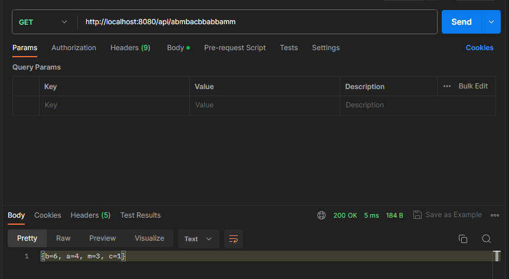

# Тестовое задание с использованием Spring REST

### Техническое задание:
Спроектировать(продумать формат и ограничения входящих/исходящих параметров) и реализовать REST API, вычисляющее частоту встречи символов по заданной строке. Результат должен быть отсортирован по убыванию количества вхождений символа в заданную строку.

Пример входной строки: “aaaaabcccc”
Пример выходного результата: “a”: 5, “c”: 4, “b”: 1

Требования к решению:
- Java 8+
- Spring boot 2+
- Решение должно быть покрыто тестами
- У решения должна быть документация по запуску и формату входящих/исходящих параметров
- Код решения необходимо разместить в публичном Github репозитории
- 
---

### Для решения задания были использованы инструменты:
- Java 8
- Spring boot 2.7.16
- JUnit 4.13.2

### Инструкция по запуску:
1. Скачать проект в удобную среду разработки (прим. IntelliJ IDEA)
2. Запустить проект
3. Совершить Get-запрос на сервер с помощью программы Postman или строки поиска в браузере, в теле запроса указать исходную строку букв (прим. http://localhost:8080/api/abbacbbabba).

---
### Пример выполнения запроса в программе Postman:

